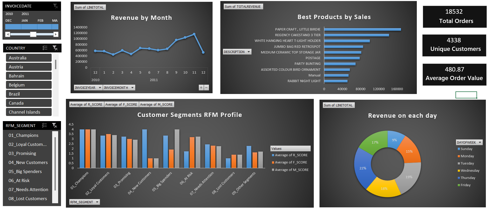

# Retail Sales and Customer Analytics

Uncover customer behavior, sales patterns, and product insights with this Excel dashboard powered by Oracle SQL and Power Pivot.

---

## 📌 Project Overview  
Retail companies often collect rich transactional data but lack structured approaches to extract business value. This project bridges that gap by delivering an interactive Excel dashboard that analyzes customer performance, sales trends, and product revenue—using advanced SQL queries and data modeling techniques.

---

## 💡 Problem Statement  
Key challenges addressed in this project include:

- Lack of structured customer segmentation (e.g., RFM-based profiling)  
- Difficulty identifying high-value vs. lost or at-risk customers  
- Limited visibility into top-selling products and time-based sales trends  
- No consolidated dashboard to visualize KPIs and segment-wise insights  

This dashboard solves the above by integrating SQL-powered analytics with intuitive Excel visuals.

---

## 🛠️ Tools & Technologies  
- **Oracle SQL + SQL Developer**: Data cleaning, transformation, customer metrics, and segmentation  
- **Microsoft Excel (2019)**: Interactive dashboard development  
- **Power Pivot**: Data modeling and relationship management between fact and dimension tables  

---

## 📊 Dashboard Structure  
The dashboard is divided into four analytical sections:

1. **Key Performance Indicators (KPIs)**  
   - Total Sales, Total Orders, Unique Customers, Average Order Value  

2. **Revenue Trends**  
   - Monthly Sales Trend (line chart)  
   - Day of Week Distribution (donut chart)  

3. **Product Performance**  
   - Top Products by Revenue (horizontal bar chart)  
   - Top Products by Quantity Sold  

4. **Customer Segmentation**  
   - Segment Distribution (bar chart)  
   - Average RFM Scores by Segment (clustered column chart)  

---

## ✅ Key Outcomes  
- Designed a complete RFM-based customer analytics pipeline in SQL  
- Developed a 4-page, slicer-enabled Excel dashboard for sales and customer insights  
- Identified key segments such as Champions, Loyal, At-Risk, and Lost customers  
- Highlighted top products and optimized marketing potential based on revenue trends

  **Snapshot:**  
   

---

## 🚀 How to Use

1. Clone this repository  
2. Open the Excel dashboard file  
3. Use the slicers to filter by **Invoice Date**, **Country**, or **Customer Segment**  
4. Explore sales trends, segment profiles, and product performance  

---

## 📁 Dataset  
The dataset (`OnlineRetail.csv`) contains ~540,000 records of UK-based retail transactions between 2010–2011, including fields such as:

- InvoiceNo, StockCode, Description, Quantity, InvoiceDate, UnitPrice, CustomerID, Country

Derived fields created during processing include:

- `LineTotal`, `InvoiceMonth`, `InvoiceYear`, and `DayOfWeek`

- **Dataset Source**: [Online Retail Dataset on Kaggle](https://www.kaggle.com/datasets/ulrikthygepedersen/online-retail-dataset)
---

## 📄 License

This project is licensed under the [MIT License](LICENSE).

---

## 📬 Contact

Naman Kumar

📧 Email: namankr24@gmail.com

🔗 GitHub: NamanKr24
---

This project demonstrates how transactional data can be transformed into business intelligence using SQL logic and Excel’s data modeling capabilities—ideal for data analysts working in retail or e-commerce domains.
